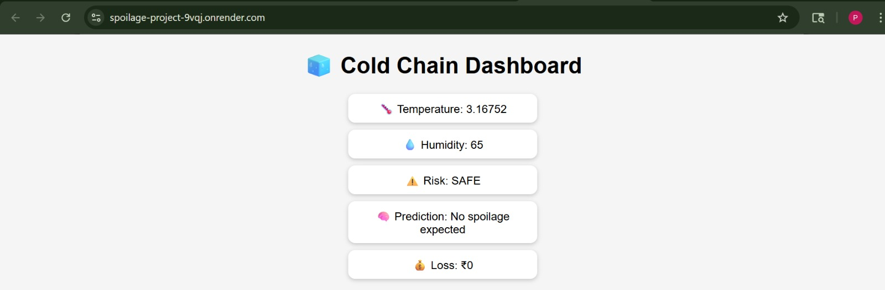
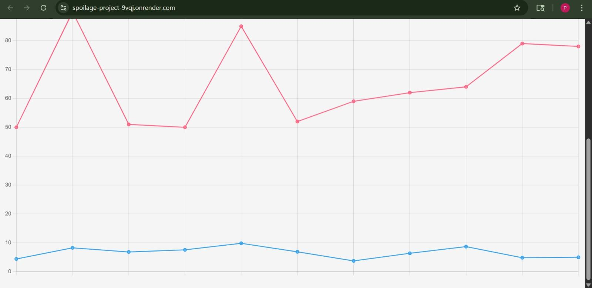
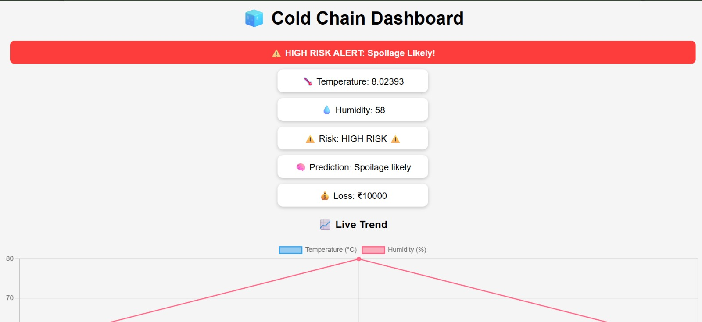

Perishable Spoilage Early Warning System
🧊 Cold Chain Spoilage Detection System

## 📌 Problem
-Temperature fluctuations during transport/storage lead to food spoilage and economic loss.

---

## 💡 Solution
-This system monitors environmental conditions in real-time and predicts spoilage risk, enabling early intervention.

---

## 🚀 Live Demo
👉 https://spoilage-project-9vqj.onrender.com

---

## 📌 Features

- 🌡️ Real-time temperature simulation  
- 💧 Humidity monitoring  
- ⚠️ Risk detection (SAFE / MEDIUM / HIGH)  
- 🚨 Blinking alert for HIGH RISK  
- 📊 Live graph using Chart.js  

---

## 📸 Screenshots

### 🧊 Dashboard

### 📊 Graph

### 🚨 Alert

---

## 🛠️ Tech Stack

- Python (Flask)
- HTML, CSS, JavaScript
- Chart.js

---

## ⚙️ How It Works

The system simulates sensor data and applies rule-based logic:

- High temperature (> 8°C) OR high humidity (> 80%) → HIGH RISK  
- Moderate temperature (> 6°C) → MEDIUM RISK  
- Otherwise → SAFE  

---

## ▶️ Run Locally

bash
pip install -r requirements.txt
python app.py

---

## 🔮 Future Scope

- 📡 Integration with real IoT sensors  
- 📱 Mobile app alerts (SMS/Notifications)  
- 📍 GPS tracking of shipments  
- 🤖 Machine Learning for accurate prediction  
